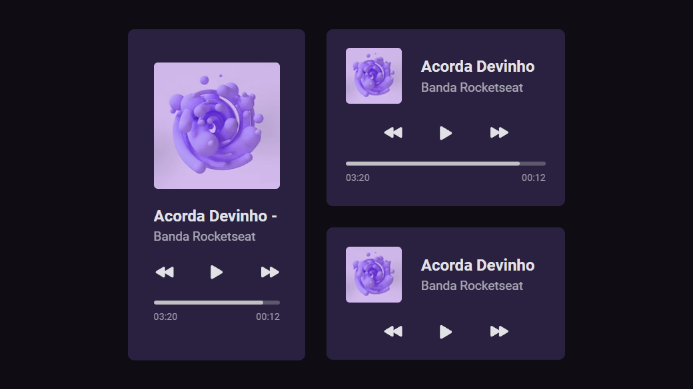

<h1 align="center">
  
</h1>

  <a href="https://www.figma.com/community/file/1195050524500542670">Week #01</a> challenge from <a href="https://boracodar.dev/">#boraCodar</a> by <a href="https://www.rocketseat.com.br/">Rocketseat</a>

<h3 align="center">
Music Player 🎵
</h3>

  

<h2>📋 The challenge</h2>

[pt-BR] Desenvolva o player conforme especificado utilizando as tecnologias da sua preferência. Você pode adicionar outros detalhes, como animações.

[en] Build the player as specified using your preferred technologies. You can add other details like animations.

  

  <i>Disclaimer: This is not a functional music player, only a visual mockup.</i>

<h3>🧪 Built with</h3>

- HTML

- CSS

<h3>🔗 Links</h3>

- Live Site URL: [https://phislipe.github.io/boracodar-01/](https://phislipe.github.io/boracodar-01/)

---

  Made by <a href="https://phislipe.dev"><b>Philipe Rocha</b></a>

