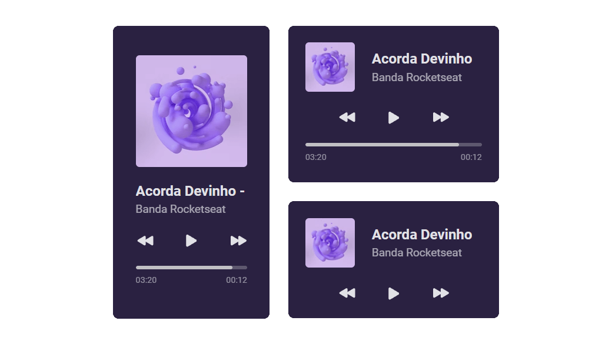

# #boraCodar (2023) - Week #01 Challenge - Music Player

> Week #01 challenge from **[#boraCodar](https://boracodar.dev/)** by Rocketseat

## The challenge

[pt-BR] Desenvolva o player conforme especificado utilizando as tecnologias da sua preferência. Você pode adicionar outros detalhes, como animações.

[en] Build the player as specified using your preferred technologies. You can add other details like animations.

## My process

Great challenge! Learned a lot about CSS `grid` with this project. After some research and trial and error, I managed to get it all working.

Decided to go a step further and added some hover animations, a slide animation to the music title, and a progress bar animation, all with CSS only.

</img>

  Disclaimer: This is not a functional music player, only a visual mockup.

### Built with

- HTML
- CSS

### Links

- Live Site URL: [https://phislipe.github.io/boracodar-desafio1/](https://phislipe.github.io/boracodar-desafio1/)

## Author

- 🌐 Website - [phislipe.dev](https://phislipe.dev)
- 🪪 LinkedIn - [Philipe Rocha](https://www.linkedin.com/in/phislipe/)
